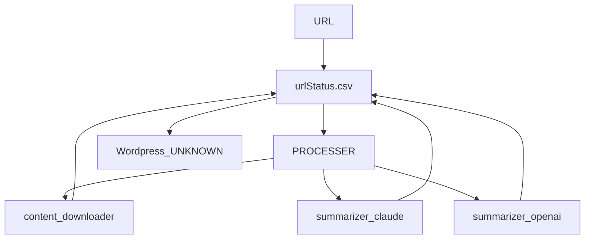

# Ovewrview of the architecture

Work on the URLs is linear (can't summarize it without having the text content, can't get the text content without the original content, etc.). 
We timestamp when and label how we did the things we do. URLs are passed in to urlStatus.csv which is currently defined as (ALL CAPS ARE IGNORED, JUST LABELS):

## Data

* fullURL
* addedDate
* status (new, downloaded, text_extracted, summarized, 
* dataURL (anchor tags stripped, GitHub raw rewrite, etc.)
* SHA256ofURL
* CONTENT DOWNLOAD
  * downloadFilename
  * downloadDate
  * downloadMethod
* CONTENT TEXT
  * textFilename
  * textDate
  * textMethod
* SUMMARY
  * CLAUDE
    * summaryClaudeResponse
    * summaryClaudeDate
    * summaryClaudePrompt
  * OPENAI
    * summaryOpenAIResponse
    * summaryOpenAIDate
    * summaryOpenAIPrompt
    
We need to rate limit our summarizations to 1 client, and in general 10,000 tokens/minute.

We also need to rate limit postings to Wordpress since TaxoPress runs which uses OpenAI.

## Long term Automation

Zapier doesn't support rate limiting easily or locking. n8n sort of does.

One option would be to kick the automation off at a safe interval like every 5 minutes using a crontab/webhook. This would be a max is 288 items a day which should be plenty.

## Summarization

Summarization includes more than just the summary of the text. We also want to:

* Create summary, ideally as lossless as possible (bullet points?)
* Determine keywords and tags (keywoprds and tags for the summary is potentially lossy)
* Determine related URLs (e.g. HNN postings with useful links)
* Determine appropriate audiences (C-level, Technologists, etc.)
* Determine what kind of content it is (article, blog, paper, etc.)
* Determine

We then create the output using Markdown format?

