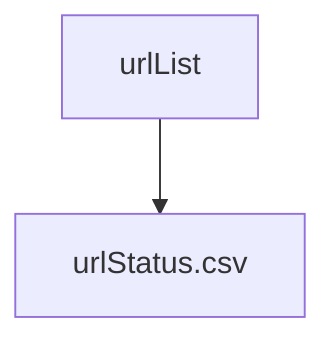

# Ovewrview of the architecture

Work on the URLs is linear (can't summarize it without having the text content, can't get the text content without the original content, etc.). 
We timestamp when and label how we did the things we do. URLs are passed in to urlStatus.csv which is currently defined as (ALL CAPS ARE IGNORED, JUST LABELS):

* fullURL
* addedDate
* status (new, downloaded, text_extracted, summarized, 
* dataURL (anchor tags stripped, GitHub raw rewrite, etc.)
* SHA256ofURL
* DOWNLOAD
* * downloadFilename
* * downloadDate
* * downloadMethod
* TEXT
* * textFilename
* * textDate
* * textMethod
* SUMMARY
* 
* summaryClaudeResponse
* summaryClaudeDate
* summaryClaudePrompt
* summaryOpenAIResponse
* summaryOpenAIDate
* summaryOpenAIPrompt

